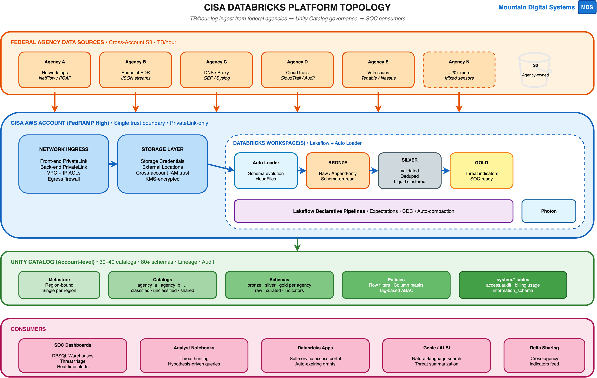
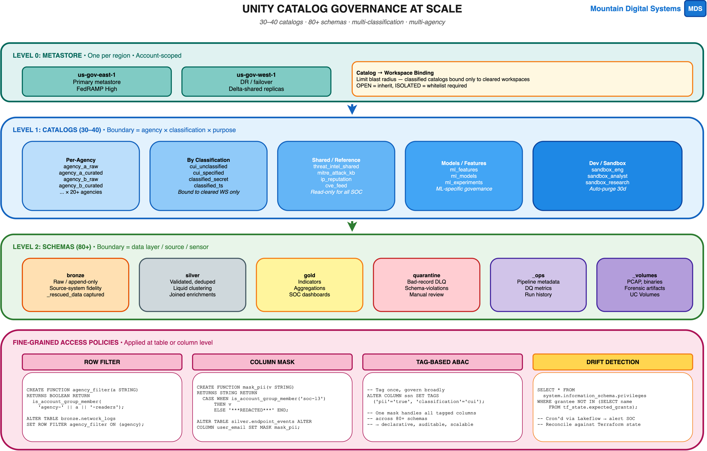
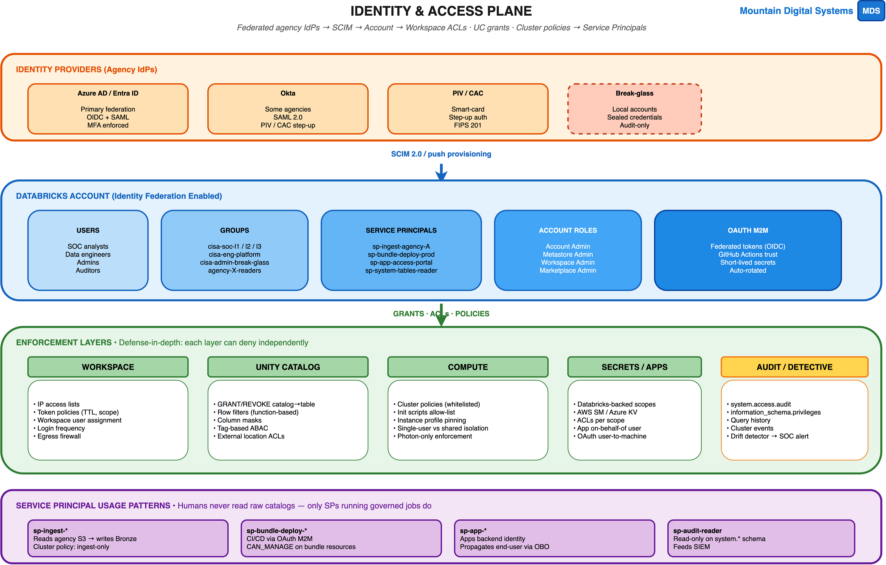
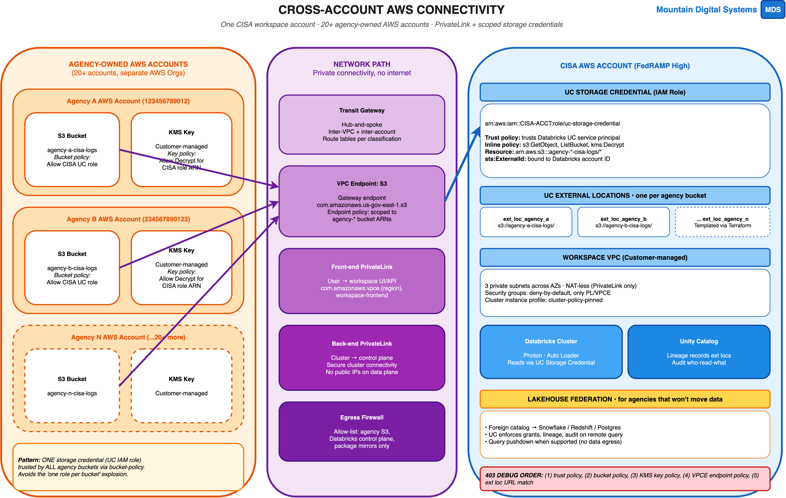
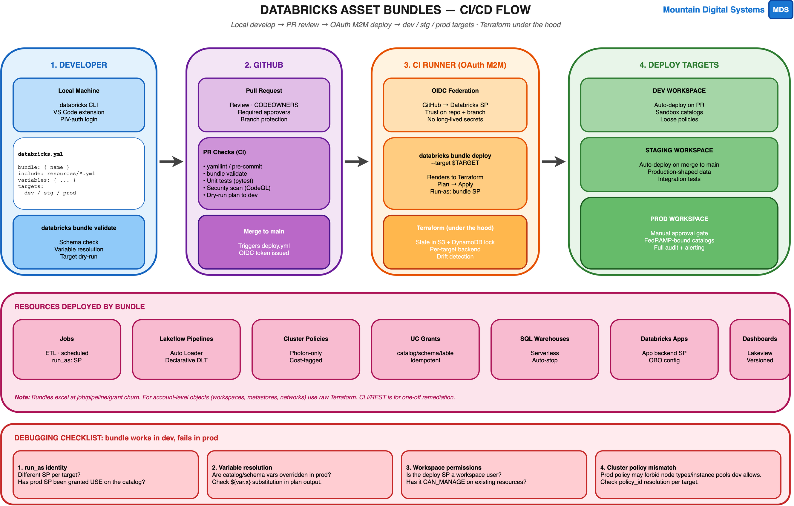
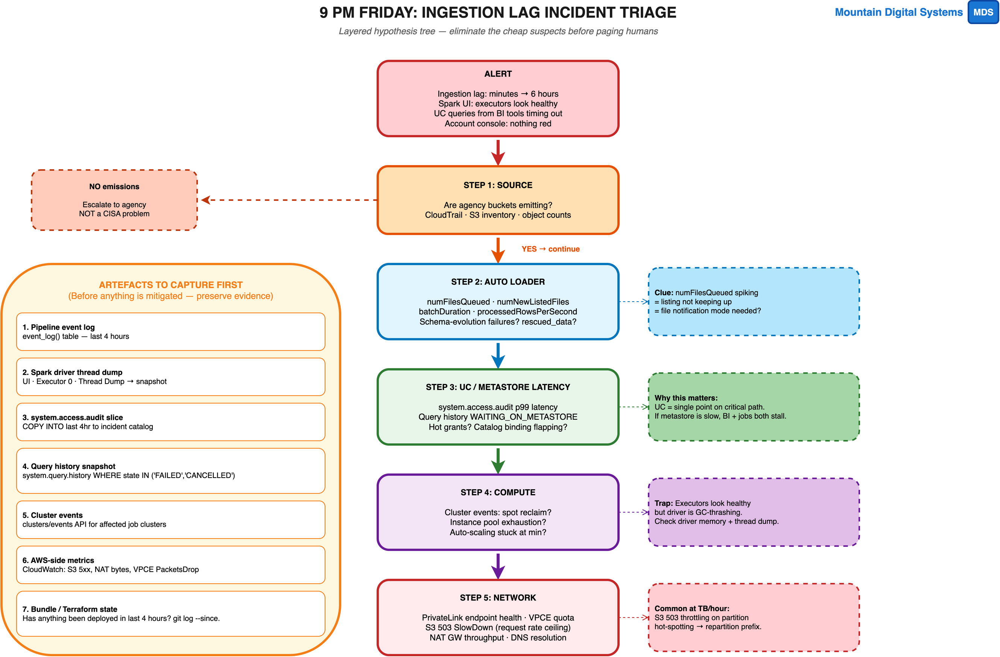

# CISA Senior Databricks Admin — Answer Guide

> Companion to `cisa-databricks-admin-interview.md`. Each answer is what a strong senior admin candidate would say. Use these as **reference / scoring anchors**, not as a script — the goal is to evaluate the candidate's reasoning, not exact phrasing.

---

## Platform Overview



*The full picture before drilling in: federal agency sources → CISA AWS account (PrivateLink + scoped storage credentials) → Databricks workspaces (Auto Loader → Bronze/Silver/Gold via Lakeflow + Photon) → Unity Catalog → SOC consumers. Every section below maps to a slice of this topology.*

---

## Section A — Unity Catalog Governance at Scale



*Reference diagram for Q1–Q6: the metastore → catalog → schema hierarchy, with row filters, column masks, tag-based ABAC, and drift detection patterns shown inline.*

### Q1. Hierarchy structure for 30–40 catalogs / 80+ schemas

**Answer:** UC is hierarchical: metastore (one per region) → catalog → schema → securable object (table, view, volume, model, function). The boundary I draw matters because grants flow downward and the catalog is the practical unit of *isolation* (it's what you bind to workspaces and what defaults to deny).

For CISA I'd structure it along three orthogonal axes:

- **Agency × purpose** — one catalog pair per agency: `agency_a_raw` (bronze-only, ingest SP-writable) and `agency_a_curated` (silver/gold, broadly readable). This keeps blast-radius small and lets you delete an agency cleanly when offboarding.
- **Classification** — separate catalogs (`classified_secret`, `classified_ts`, `cui_specified`) bound *only* to cleared workspaces. Never mix classifications inside a catalog — workspace binding is your last line of defense if a grant is misconfigured.
- **Shared / reference** — cross-cutting catalogs like `threat_intel_shared`, `mitre_attack_kb`, `cve_feed` that the SOC reads everywhere.

**Catalog vs. schema rule of thumb:**
- Catalog = something you'd want to *bind to a different workspace*, *grant to a different group at the top*, or *delete as a unit*.
- Schema = a data layer (bronze/silver/gold) or a sensor/source within an agency.

What I avoid: one giant `cisa` catalog with 80 schemas — that loses the workspace-binding lever and forces you to manage 80 grant trees instead of one per agency.

### Q2. Row filters / column masks vs. dynamic views

**Both enforce fine-grained access; they differ in *where* the policy lives and *who can see it*.**

| | Row filter / column mask | Dynamic view |
|---|---|---|
| Lives on | Base table (UC function attached) | Separate view object |
| Applies to | Every reader of the table | Only readers of the view |
| Bypass risk | None (UC enforces at the engine) | Yes — if a user has `SELECT` on the base table, they bypass |
| Schema impact | Transparent — table shape unchanged | Requires consumers to query the view name |
| Tooling | One function reusable across many tables | Each view is bespoke |

**When I reach for each:**
- **Row filter / column mask** for *defaults* — masking PII, agency-scoped row visibility. Apply once at silver, every downstream reader inherits. This is the right answer 90% of the time.
- **Dynamic view** for *exceptions* — a specific dashboard that needs a denormalized cut, or a sharing scenario where I want to publish a curated subset without granting on the base table. Also useful when the policy logic is too complex/joined for a function.

**Rule:** if a human user can `SELECT *` on the base table, dynamic views are theater. Lock the base, then build views on top.

### Q3. Onboarding a new agency Monday

End-to-end sequence — what's automated (bundles/Terraform) vs. one-time manual:

1. **Agency-side** *(manual coordination, document)* — agency creates S3 bucket, KMS CMK, attaches bucket policy + key policy trusting CISA's UC IAM role with `sts:ExternalId`.
2. **Network** *(Terraform)* — extend egress firewall allow-list, update VPCE endpoint policy if the bucket ARN pattern is new.
3. **Storage credential** *(Terraform, idempotent)* — single shared UC storage credential trusts all agency buckets via wildcard ARN; usually nothing to add here.
4. **External location** *(bundle/Terraform)* — `databricks_external_location` per bucket, GRANT `READ FILES` to ingest SP only.
5. **Catalogs** *(bundle)* — create `agency_X_raw` + `agency_X_curated`; bind to appropriate workspace(s); set owner.
6. **Schemas** *(bundle)* — bronze, silver, gold, quarantine, _ops, _volumes.
7. **Groups & grants** *(bundle, SCIM-synced)* — `agency-X-readers`, `agency-X-engineers`, ingest SP. GRANTs follow least-privilege from the bundle file.
8. **Pipelines** *(bundle)* — Auto Loader + Lakeflow declarative pipeline scaffolded from a template.
9. **Tags** *(bundle)* — `agency=X`, `classification=…`, `cost_center=…` for billing attribution.
10. **Smoke test + handoff** *(manual)* — run a canary file end-to-end, verify lineage shows up, hand the dashboard URL to the agency POC.

**Manual-only**: cross-account trust agreements, the first KMS key policy review, and the smoke test sign-off. Everything else is in Git.

### Q4. Detecting grant sprawl

Daily Lakeflow job (writes to `_ops.grant_audit`):

```sql
-- All grants currently in effect, joined to expected grants from TF state
SELECT p.grantor, p.grantee, p.privilege_type, p.object_type, p.object_full_name
FROM system.information_schema.privileges p
LEFT JOIN tf_state.expected_grants e
  ON p.grantee = e.grantee AND p.object_full_name = e.object_full_name
WHERE e.grantee IS NULL
  AND p.grantee NOT IN ('account users')  -- exclude allow-listed
  AND p.object_full_name LIKE 'cisa.%';
```

I also watch:
- `system.access.audit` for `grantPrivilege` events (real-time SIEM stream).
- `system.information_schema.catalog_privileges` for top-level catalog grants — these have the largest blast radius.
- `MANAGE` privileges anywhere — should be a finite list of admin SPs.

**Cadence:** real-time SIEM alert on `grantPrivilege` outside CI/CD; daily reconciliation against TF state; weekly review of `MANAGE` holders.

### Q5. Catalog binding to workspaces

`OPEN` (default) means any workspace in the metastore can use the catalog if grants permit. `ISOLATED` means you must explicitly bind workspaces.

For CISA, classified catalogs are always `ISOLATED` and bound only to cleared workspaces. This is the single most important defense against accidental cross-classification leakage:

- A misconfigured grant on a classified catalog still cannot be used from an unclassified workspace.
- It contains blast-radius if SCIM pushes a wrong group membership.
- It makes "which workspaces can possibly query this catalog?" a one-line answer.

I'd rather have *more* catalogs and tight workspace binding than fewer catalogs with loose binding.

### Q6. Tag-based ABAC across 80+ schemas

The naïve approach is one mask function per column → unmaintainable at scale. Tag-based ABAC inverts it:

```sql
-- 1. Tag once, declaratively
ALTER TABLE silver.endpoint_events ALTER COLUMN user_email
  SET TAGS ('pii'='true', 'classification'='cui');

-- 2. One function handles every tagged column
CREATE FUNCTION mask_pii(v STRING) RETURNS STRING RETURN
  CASE WHEN is_account_group_member('soc-l3') THEN v
       ELSE '***REDACTED***' END;

-- 3. Bind via column mask referencing the function
```

Pair with a Lakeflow job that scans `information_schema.column_tags` and asserts every `pii=true` column has a mask attached → fails CI if a new column is tagged but unmasked. That gives you declarative, auditable, scalable governance.

---

## Section B — Identity, Service Principals & OAuth



*Reference diagram for Q7–Q11: the four layers of identity flow (IdPs → SCIM → Account → Enforcement), where each control denies independently. SP usage patterns at the bottom map to Q9.*

### Q7. Account SP vs. workspace SP vs. AWS IAM role

- **Account-level SP** — exists in the Databricks account, can be added to any workspace, can hold UC privileges. Use for anything that crosses workspaces (CI/CD, system-wide ingest).
- **Workspace-level SP** — scoped to one workspace, cannot hold account-level privileges. Use for one-off, workspace-scoped automation (rare).
- **AWS IAM role (storage credential)** — the *AWS-side* identity Databricks assumes to read S3. Distinct from the SP — the SP is *who* runs the job; the IAM role is *how* that job reads S3.

For cross-account agency ingestion: **account-level SP** running the job + **single shared UC storage credential (IAM role)** trusted by all agency buckets via bucket policy. The SP gets `READ FILES` on the external location; UC translates that to a scoped STS AssumeRole at query time. Don't use instance profiles — they predate UC and break lineage.

### Q8. OAuth M2M for GitHub Actions → FedRAMP workspace

Setup:
1. Create account-level SP `sp-bundle-deploy-prod`.
2. Configure **federated credentials** on the SP that trust `repo:cisa/databricks-bundles:ref:refs/heads/main` via GitHub's OIDC issuer.
3. In the workflow, request a GitHub OIDC token, exchange for a Databricks OAuth token via `databricks auth login --host ... --client-id ...`.
4. Bundle deploy uses that short-lived token; nothing persisted.

Failure modes I've hit:
- **Trust scope too broad** — federated credential matched any branch instead of `main`. Fix: pin to specific ref/environment.
- **Token expiry mid-deploy** — long bundle deploys exceeding token lifetime. Fix: shorter, more atomic deploys; or refresh.
- **Workspace not entitled** — SP exists at account but isn't a workspace user. Symptom: 403 on `bundle deploy`. Fix: add SP to the workspace via Terraform.
- **Drift on the federated credential** — someone updated the OIDC subject claim format. Fix: pin the audience claim and add a check.

Rotation: with OIDC there are no client secrets to rotate, which is the point.

### Q9. Layered enforcement for "no humans on raw"

Five layers, each can deny independently:

1. **SCIM groups** — humans go in `cisa-soc-*` and `cisa-eng-*`; raw catalogs grant only to `sp-ingest-*`.
2. **UC grants** — `agency_X_raw` has no `SELECT` for any human group. Period.
3. **Catalog binding** — raw catalogs bound only to ingest workspaces; analyst workspaces can't see them.
4. **Cluster policies** — analyst clusters use a policy that pins single-user mode + restricted catalogs.
5. **IP ACLs / token policies** — raw workspace API access from CI runner CIDR only.

Detective layer: a `system.access.audit` rule that fires if a human principal name ever appears against a raw-catalog object → SOC alert, regardless of outcome (deny still gets logged).

### Q10. SCIM groups vs. native groups

**Mix them carefully.** SCIM-synced groups are sourced from the IdP; native groups are managed in Databricks. The trap:

- SCIM groups are *replaced* on sync — adding a member in Databricks UI gets blown away on next sync.
- Native groups can contain SCIM groups → useful for "engineers + on-call SOC L3" composite groups.
- A SCIM group cannot contain a native group (one-way nesting).

What bit me: ops team added a member to a SCIM group via the Databricks UI for a 1-hour exception. SCIM sync 4 hours later wiped the membership and a critical job lost permission. Lesson: any membership change has to go through the IdP, not the Databricks UI.

### Q11. Break-glass accounts

Two local account-admin accounts, sealed credentials in two separate physical safes (split-knowledge). MFA enforced via FIDO2 hardware key. Use cases:

- IdP outage breaks federation.
- Need to revoke a compromised admin's access fast.
- Forensic investigation that must not touch the federation.

Controls:
- `system.access.audit` SIEM rule fires immediately on any login or use.
- Quarterly rotation + tabletop test.
- Cannot be used to grant or modify other admins (separation enforced via custom monitoring).
- Auto-disable after 24 hours of activity → re-seal.

---

## Section C — Cross-Account AWS Connectivity



*Reference diagram for Q12–Q16: agency-owned accounts (left) → network path with TGW/VPCEs/PrivateLink (middle) → CISA account with the single shared UC storage credential and external locations (right). The 403 debug order at the bottom answers Q14.*

### Q12. IAM trust pattern for 20+ buckets without role explosion

**Pattern: ONE storage credential, MANY bucket policies.**

```
arn:aws:iam::CISA:role/uc-storage-credential
  trust policy: trusts Databricks UC service principal w/ external-id

each agency bucket:
  bucket policy: allows [s3:Get*, s3:List*] from CISA UC role ARN
  key policy:    allows kms:Decrypt from CISA UC role ARN
```

The UC role's inline policy uses a wildcard:
```json
{ "Resource": "arn:aws:s3:::agency-*-cisa-logs/*" }
```

Adding a new agency = adding two policy statements (their bucket + their KMS key), not creating a new role. Avoids the IAM role limit and keeps one trust boundary to audit.

### Q13. PrivateLink / VPC peering trade-offs

| | VPC peering | Front-end PrivateLink | Back-end PrivateLink |
|---|---|---|---|
| What it connects | Two VPCs (subnet routing) | User → workspace UI/API | Cluster → control plane |
| Public IP needed | No | No | No |
| Granularity | All-or-nothing per peer | Per-endpoint | Per-endpoint |
| FedRAMP-friendly | OK but coarse | Required pattern | Required pattern |
| Cost | $/GB processed | $/hour + $/GB | $/hour + $/GB |
| Failure mode | Routing loops, CIDR overlap | DNS misconfig | Quota exhaustion |

For CISA: **front-end + back-end PrivateLink, no NAT gateway, no internet route**. VPC peering only for internal CISA → CISA traffic. The combination is what FedRAMP High effectively expects.

### Q14. 403 AccessDenied debug order

Walk it from outside-in (cheapest checks first):

1. **External location URL match** — does the URL exactly match the external location? Trailing-slash mistakes are common.
2. **UC grant** — does the SP have `READ FILES` on the external location?
3. **Storage credential trust policy** — is the Databricks principal still trusted? External-ID still matching?
4. **Bucket policy** — does it allow the CISA role ARN? Has the bucket owner changed it?
5. **KMS key policy** — most missed step. Bucket access ≠ object decryption. Verify `kms:Decrypt` for the role.
6. **VPCE endpoint policy** — does the gateway endpoint policy permit this bucket ARN?
7. **CloudTrail** — last resort: look at the actual STS / S3 events for the deny reason.

The intermittent nature usually points to KMS grant TTL or an STS rate limit at high concurrency.

### Q15. Lakehouse Federation for agencies that won't move data

Foreign catalog → Snowflake/Redshift/Postgres connection. UC enforces grants/lineage/audit on the *query*, with pushdown to the remote engine.

Trade-offs:
- ✅ No data egress; agency keeps governance over their warehouse.
- ✅ Single pane of glass for SOC analysts.
- ❌ Performance bound by remote engine; no Photon, no liquid clustering.
- ❌ Some predicates don't push down (UDFs, complex expressions) → full extract.

Use it for **dimension/reference data** that analysts need to *join* against, not for the high-volume facts. For high-volume telemetry, push the agency to land into S3 instead.

### Q16. VPC endpoint policy as defensive layer

The S3 gateway endpoint policy sits in the AWS data path between the cluster and S3. It's evaluated *before* IAM. Concretely, even if your storage credential were misconfigured to allow `s3:*`, an endpoint policy of:

```json
{ "Resource": ["arn:aws:s3:::agency-*-cisa-logs/*",
               "arn:aws:s3:::cisa-managed-*"] }
```

prevents traffic to any *other* bucket from your VPC. It's the strongest "data exfiltration to a random S3 bucket" defense — IAM can be wrong; endpoint policy is enforced at the network.

---

## Section D — Automation: CLI, REST API & Asset Bundles



*Reference diagram for Q17–Q21: the four-stage flow (developer → GitHub → OAuth M2M runner → dev/stg/prod targets), the resources bundles deploy, and the dev-vs-prod failure checklist that answers Q19.*

### Q17. 200 notebooks granted ALL_PRIVILEGES — audit & remediate

```python
# Idempotent, dry-run-able remediation
import argparse
from databricks.sdk import WorkspaceClient

w = WorkspaceClient()
parser = argparse.ArgumentParser()
parser.add_argument("--dry-run", action="store_true", default=True)
args = parser.parse_args()

bad_grant = "ALL_PRIVILEGES"
bad_grantee = "account users"

# Discover
notebooks = list(w.workspace.list("/", recursive=True))
nb_paths = [o.path for o in notebooks if o.object_type.value == "NOTEBOOK"]

violations = []
for path in nb_paths:
    perms = w.workspace.get_permissions(workspace_object_type="notebooks",
                                        workspace_object_id=path)
    for acl in perms.access_control_list:
        if acl.group_name == bad_grantee and any(
            p.permission_level.value == bad_grant for p in acl.all_permissions
        ):
            violations.append((path, acl))

print(f"Found {len(violations)} violations")
if args.dry_run:
    for p, _ in violations[:10]:
        print(f"  would remediate: {p}")
    raise SystemExit(0)

# Remediate — replace with CAN_READ for account users
for path, _ in violations:
    w.workspace.set_permissions(
        workspace_object_type="notebooks",
        workspace_object_id=path,
        access_control_list=[{
            "group_name": bad_grantee,
            "permission_level": "CAN_READ"
        }],
    )
```

Idempotency: re-running finds zero violations. Dry-run is the default — destructive flag must be passed. Output is committed to a remediation log table for audit.

### Q18. Bundles vs. Terraform vs. REST API

| | Bundles | Terraform | REST/CLI |
|---|---|---|---|
| Best at | Jobs, pipelines, dashboards, apps | Workspaces, metastores, networking, account-level | One-off remediation, ad-hoc ops |
| State | Tracks via `.databricks/` + TF under hood | Explicit `.tfstate` | Stateless |
| Multi-target | First-class (`targets:` in YAML) | `workspace` modules | Manual |
| Audience | Data engineers | Platform admins | Both, sparingly |
| Bundles fall down for | Account-level objects (workspaces, metastores), networking, IAM | (this is its sweet spot) | (no abstraction) |

Where bundles fall down at admin layer:
- Can't create workspaces or metastores.
- Can't manage account-level groups (SCIM territory).
- Limited expressiveness for conditional logic across targets — you end up with templating gymnastics.

My split: Terraform owns the *platform* (workspaces, networks, account SPs, metastores, storage credentials). Bundles own the *workload* (jobs, pipelines, grants, dashboards). REST/CLI for `oh-shit-fix-this-now` moments.

### Q19. Bundle works in dev, fails in prod with permission errors

Checklist (the order matters — eliminate cheap suspects first):

1. **`run_as` identity** — different SP per target? Has the prod SP been granted `USE CATALOG` on the target catalog? Most common cause.
2. **Variable resolution** — is `${var.catalog}` resolving to the prod catalog name? Run `databricks bundle validate -t prod` and inspect.
3. **Workspace permissions** — is the deploy SP a workspace user *and* does it have `CAN_MANAGE` on existing resources? Bundles fail when they try to update a job they don't own.
4. **Cluster policy mismatch** — prod policy may forbid node types/instance pools that dev allows. Resolve `policy_id` per target.
5. **External location grants** — pipeline writes to a path the prod SP can't reach.
6. **Permissions blocks in YAML** — `permissions:` in resource files is *replace*, not merge. A missing entry silently revokes prod access.

### Q20. Policy-as-code preventing rogue clusters

**Server-side enforcement (real):**
- **Cluster policies** with `fixed`/`forbidden` constraints — pin Photon, max DBU, allowed node types, init script allow-list.
- **Permissions** — engineers get `CAN_USE` on policies, not `CAN_CREATE` on clusters. Cluster creation is impossible without picking a policy.
- **Account-level cluster policy assignments** — even if someone bypasses workspace UI via API, the account-level policy applies.

**What you cannot enforce server-side:**
- Code patterns inside notebooks — a user can still write inefficient SQL.
- Workspace-admin escape hatches — workspace admins can grant `CAN_CREATE` to themselves; you need detective controls (audit log alerts).
- Time-bounded approvals — UC has no native expiring grants; build it with a Lakeflow job that revokes after N days.

**Detective complement:** SIEM alert on `clusters/create` events that don't reference a policy_id, on `permissions/update` for cluster-create, and on policy edits.

### Q21. Decision tree

```
Is it account-level (workspaces, metastores, networks, account SPs)?
  → Terraform
Is it workload (jobs, pipelines, grants, dashboards, apps)?
  → Bundle
Is it a one-time remediation or investigation?
  → CLI / REST script (committed to a remediation repo)
Is it a notebook-style ad-hoc query against system tables?
  → SQL in a notebook, no code, no commit
```

The discipline: nothing important changes outside of Git. Anything that did change outside Git is *drift*, and drift gets reconciled or alerted.

---

## Section E — Semi-Structured & Unstructured Data

### Q22. Auto Loader vs. Lakeflow Declarative Pipelines vs. Structured Streaming

| | Auto Loader (in a notebook) | Lakeflow Declarative Pipelines | Hand-rolled Structured Streaming |
|---|---|---|---|
| Defines | Source reader | Whole pipeline graph + expectations | Custom logic |
| Schema evolution | Yes (`addNewColumns`, `rescue`) | Yes, plus expectation enforcement | Manual |
| State management | You own checkpoints | Managed | You own |
| Compaction / retention | Manual | Auto | Manual |
| Best for | Bronze ingest only | Full bronze→silver→gold | Edge cases (custom stateful, exotic sources) |

What I care about as an admin (and a data engineer might not):
- **Failure modes** — Lakeflow pipelines self-heal; hand-rolled jobs need bespoke retry logic.
- **Cost predictability** — Lakeflow scales workers automatically; hand-rolled jobs over-provision out of fear.
- **Observability** — pipeline event log is queryable, structured. Hand-rolled jobs spew text logs.
- **Lineage** — declarative pipelines give UC lineage for free; hand-rolled jobs need explicit `OPTIMIZE WRITE` paths for UC to track.

For TB/hour from 20+ agencies → declarative pipelines as the default; Auto Loader-in-a-notebook for prototyping; hand-rolled only when you genuinely need custom stateful logic.

### Q23. Deeply nested JSON flattened to 400 columns — admin concerns

The data engineer optimized for query simplicity. As admin I push back on:

- **Wide tables hurt scans.** Parquet is column-store; 400 columns means 400 files-per-row-group worth of metadata. Predicate pushdown still works but file pruning suffers.
- **Liquid clustering picks 4 columns.** With 400 candidates the engineer needs to be deliberate. Default = cluster on the predicates SOC actually filters by (timestamp, src_ip, agency).
- **Small-file problem.** TB/hour streaming + 400-column writes can produce many small files. Lakeflow's auto-compaction helps; hand-rolled jobs need explicit `OPTIMIZE` cron.
- **Schema drift is now 400× as likely.** Every nested array/struct is a future schema-evolution event.
- **PII tagging.** With 400 columns nobody manually tags PII correctly — need automated tag inference from data classification scans.

Counter-proposal: keep the raw JSON as a `MAP<STRING,STRING>` or `VARIANT` column in bronze + selectively project to silver. Let analysts pay the parse cost only on columns they query.

### Q24. PCAP / binary forensic artifacts

Three options, in order of preference:

1. **UC Volumes (managed or external)** — best for governance. Files appear as paths under `/Volumes/catalog/schema/volume/`, get UC grants/audit/lineage, but are *not* queried as tables. Ideal for PCAP, EDR captures, malware samples.
2. **External location only** — if files are huge and access is rare. UC manages access; metadata stays in catalog tags.
3. **Outside Databricks** — for active forensic workflows that need specialized tools (Wireshark, Volatility). Keep an *index* table in UC pointing to S3 paths.

Compliance angle: Volumes give you who-read-what audit on individual binaries — this matters for chain-of-custody. External locations give you the access control but the audit is at the location level, not per-file.

### Q25. Schema drift / bad records at platform level

Three pillars:

1. **`_rescued_data` everywhere.** Auto Loader's rescue column captures fields that don't fit the inferred schema → never lose data, never fail the batch.
2. **Quarantine schema.** Records failing expectations route to `<catalog>.quarantine.<source>` with the failure reason. SOC doesn't see them; engineers triage weekly.
3. **DLQ alerting.** A Lakeflow expectation on the quarantine table that fires if quarantine rate > N% of total → indicates an upstream schema change, page the engineer.

Platform-level standardization: a bundle template that every new pipeline inherits — same rescue handling, same quarantine schema, same DLQ alert. New engineers don't reinvent the pattern.

---

## Section F — Performance & Pipeline Modernization

### Q26. RDD → DataFrame conversion lessons

**Catalyst/AQE wins I've measured:**
- **Predicate pushdown** — RDD code pulls everything to the driver before filtering; DataFrame pushes filter into Parquet read. 10–50× scan reduction.
- **Whole-stage codegen** — single tight loop instead of iterator chain. ~3–5× CPU reduction on numeric aggregations.
- **AQE coalesce + skew handling** — automatic shuffle partition coalescing eliminates the "tune `spark.sql.shuffle.partitions` per job" tax.
- **AQE join strategy switch** — broadcast vs. shuffle decided at runtime. Huge for variable-size enrichments.

**Where DataFrames don't help:**
- **Python UDFs** — kill codegen and force serialization across JVM↔Python. Pandas UDFs help; SQL functions help more.
- **Complex stateful streaming** — `mapGroupsWithState` is more expressive than DataFrame ops for some session-window logic.
- **Custom partitioners or RDD-level locality** — rare but real for some graph workloads.

**When I'd still reach for Dataset/RDD:**
- Custom encoders for complex types where Catalyst struggles.
- A specific bug in Catalyst (rare, but I've seen it on edge-case nested types).
- Migrating *legacy* code where the cost of full rewrite exceeds the perf gain.

### Q27. Streaming job falling behind — triage

What I check first, in order:

1. **Source side** — `numFilesQueued` in Auto Loader metrics. If it's growing, the listing/notification path is the bottleneck. Switch to file-notification mode if on directory listing.
2. **Trigger interval** — too frequent = overhead per micro-batch; too slow = backlog. For TB/hour I usually run 30-second to 2-minute triggers.
3. **Source file sizing** — many tiny files? Talk to the agency about batching, or accept it and tune Auto Loader's `maxFilesPerTrigger` higher.
4. **Cluster sizing** — executor CPU should be 60–80% utilized. Below = under-parallelized; pegged = under-resourced. Check Spark UI executor tab.
5. **Shuffle partitions** — defaults are wrong for streaming. AQE helps but I still set `spark.sql.shuffle.partitions` to ~3× executor cores.
6. **Downstream compaction** — bronze writes lots of small files; if downstream silver job has to read them, compaction lag becomes silver's problem. Liquid clustering or `OPTIMIZE` on bronze.
7. **Sink side** — UC commit conflicts, especially under high concurrency. `_delta_log/` health.

Spark UI artefacts: executor tab (CPU/memory/GC), SQL tab (long-running query), streaming tab (batch duration trend, input rate vs. processing rate).

### Q28. Liquid clustering + predictive optimization vs. legacy OPTIMIZE/ZORDER/VACUUM

**Old model:** cron'd `OPTIMIZE table ZORDER BY (col)` weekly + `VACUUM table RETAIN N HOURS` to clean up. Tunable but every team reinvents the schedule.

**New model:**
- **Liquid clustering** — define clustering once at table-create; system maintains incrementally on writes. No more periodic full-rewrite.
- **Predictive optimization** — Databricks decides *when* to optimize each table based on access patterns. Replaces cron entirely.

What still needs babysitting:
- Picking the *right* clustering keys — system can't guess. I review weekly via `system.access.audit` query patterns vs. clustering choice.
- Tables predictive optimization can't see — managed tables only; external tables still need manual.
- VACUUM retention — predictive optimization vacuums, but compliance/forensics may need longer retention overrides.
- Cost — predictive optimization runs *somewhere*; I tag the spend and watch it.

Not a silver bullet, but it eliminates the boring half of admin work.

### Q29. Photon for high-cardinality log workloads

**Pays off when:**
- SQL-heavy aggregations, joins, scans on Parquet/Delta.
- DBSQL warehouses (Photon is the engine).
- Wide scans with predicate pushdown.

**Doesn't pay off when:**
- Heavy Python UDFs (Photon falls back to JVM).
- Tiny datasets where startup dominates.
- Workloads dominated by I/O wait (Photon doesn't make S3 faster).

For high-cardinality logs: Photon is usually a clear win because the joins (against threat intel, CVE feed, IP reputation) are the hot path, and those *are* what Photon accelerates. Caveat: profile first. I've seen 4× wins on aggregations and 1.0× on UDF-heavy enrichment in the same workspace.

Decision: enable Photon by default in cluster policies; allow opt-out via cost-aware policy for clearly UDF-bound jobs.

---

## Section G — Databricks Apps

### Q30. Auto-expiring catalog grants — Databricks App vs. external vs. Genie

| | Databricks App | External app + UC API | Genie / AI-BI |
|---|---|---|---|
| Backend lives in | Databricks workspace | Wherever you host | Databricks |
| Auth to UC | App's SP (or OBO) | Whatever you build | Inherits user |
| Build effort | Medium | High | Low (but limited) |
| Compliance posture | In-boundary, easier ATO | Out-of-boundary, separate ATO | In-boundary |
| Best for | Workflow apps with state | Heavy custom UI | Read-only NL search |

For *auto-expiring grants*, I'd build a Databricks App: front-end React, backend Python/FastAPI calling the UC permissions API. Workflow:

1. User submits request → App stores in a Delta table.
2. Approval workflow (Slack/email).
3. On approval: App's SP issues `GRANT` with TTL recorded.
4. Lakeflow job runs hourly, finds grants past TTL, issues `REVOKE`.

Admin owns: the App's SP permissions, the audit table, the revocation job, the approval policy. The *engineers* own the React side.

### Q31. End-user identity propagation in multi-tenant App

Default: app runs as developer's identity → all users see the same data. Wrong for multi-tenant.

**On-behalf-of (OBO):** the app receives the end-user's OAuth token, exchanges it for a Databricks token *for that user*, issues UC queries as the user. Row filters and column masks then apply correctly per user.

Wiring:
1. App configured with `user_authorization` enabled.
2. Front-end gets user's OAuth token from the workspace login.
3. Backend uses Databricks SDK with the user's token (not the app's SP).
4. UC sees the user's group memberships → row filter functions like `is_account_group_member('agency-X-readers')` resolve correctly.

Pitfall: long-running jobs (>1 hr) outlive the user's token. Solution: kick off the job *as* the user (UC enforces), but the job runner uses the app SP for compute orchestration only.

---

## Section H — Scenarios & Judgment



*Reference diagram for Q32: the layered hypothesis tree (source → Auto Loader → metastore → compute → network) and the artefacts-to-capture-first list on the left.*

### Q32. 9 PM Friday — first hour

**First, capture artefacts before mitigating** (this is the hard discipline):
1. Pipeline event log — last 4 hours.
2. Spark driver thread dump.
3. `system.access.audit` slice → COPY INTO incident catalog.
4. `system.query.history` for failed/cancelled queries.
5. Cluster events API output.
6. CloudWatch S3 5xx, NAT bytes, VPCE drops.
7. `git log --since=4h` on the bundle repo — was anything deployed?

**Then triage in layers** (cheap suspects first):
1. **Source** — are agency buckets emitting? CloudTrail. If no → escalate to agency, not my problem.
2. **Auto Loader** — `numFilesQueued` spiking? Listing can't keep up → switch to file-notification mode if on directory listing.
3. **UC / metastore** — `WAITING_ON_METASTORE` in query history? Hot grant? UC is on the critical path for *both* ingest and BI, which matches symptoms.
4. **Compute** — driver GC? Spot reclaim? "Healthy executors" can hide a thrashing driver.
5. **Network** — S3 503 SlowDown? Common at TB/hour from prefix hot-spotting → repartition by hash-prefix.

The "executors look healthy + UC slow + ingest lag" pattern most likely points to **metastore-side latency** — UC is the shared dependency. Confirm with `system.access.audit` p99.

Mitigation order: identify root cause → fix or contain → resume ingest → backfill the gap from bronze → postmortem on Monday.

### Q33. Drift — manual MANAGE grant 3 months ago

**(a) Find every drift across the account:**
```sql
WITH actual AS (
  SELECT * FROM system.information_schema.privileges
  WHERE inherited_from = 'NONE'
)
SELECT a.*
FROM actual a
LEFT JOIN tf_state.expected_grants e
  USING (grantee, privilege_type, object_full_name)
WHERE e.grantee IS NULL;
```
Run this against TF state import. Anything in `actual` but not `expected` is drift.

**(b) Reconcile:**
- Decide per-row: legitimate (codify in TF) or unauthorized (revoke).
- Submit a single "drift reconciliation" PR with all the `databricks_grant` resources added or revocations applied.
- Apply via CI/CD, not manually.

**(c) Prevent recurrence without blocking emergency access:**
- Detective: real-time SIEM rule on `grantPrivilege` events not originating from the bundle SP.
- Preventive (mostly): remove `MANAGE` from human admin groups; only the bundle SP and break-glass accounts have it.
- Emergency lane: documented break-glass procedure that uses a sealed account, auto-alerts SOC, auto-files a remediation ticket, expires in 24 hours.

The mistake to avoid: making emergency access *impossible*. The right move is making it *expensive* and *visible*.

### Q34. $400K/month spike attribution

Step 1 — slice `system.billing.usage`:
```sql
SELECT
  usage_date,
  workspace_id,
  custom_tags['agency'] AS agency,
  custom_tags['cost_center'] AS cc,
  sku_name,
  SUM(usage_quantity) AS dbus,
  SUM(usage_quantity * list_prices.pricing.default) AS dollars
FROM system.billing.usage u
JOIN system.billing.list_prices lp USING (sku_name, cloud)
WHERE usage_date >= current_date() - 30
GROUP BY 1, 2, 3, 4, 5
ORDER BY dollars DESC;
```

Step 2 — drill: which sku grew? Usually one of:
- All-purpose compute spike → an analyst ran a runaway notebook.
- Job compute spike → bad join or skew, look at query history.
- DBSQL warehouse → autoscaling stuck high; SOC dashboard polling too aggressively.
- Serverless → Photon doing more work because liquid clustering wasn't tuned.

Step 3 — governance:
- Mandatory tags on every resource via cluster policy and bundle defaults — `agency`, `cost_center`, `owner`. Untagged → can't run.
- Budget alerts via `system.billing.usage` Lakeflow expectations (per-agency).
- Cluster policy max DBU caps — even "all-purpose" has a ceiling.
- Cost dashboard showing 7-day rolling cost per agency, surfaced to engineering leads.

Step 4 — cultural: monthly cost review with the team that caused it. Visibility prevents recurrence more than tech controls do.

### Q35. The candidate's gap — "structured data, less platform admin"

How I'd sell that:

> "Most platform admins come up through ops and learn data later. I came up through data and learned platform — which is the *direction the platform is moving*. Unity Catalog, declarative pipelines, predictive optimization: these collapse the line between admin and data engineering. The admin job is increasingly *governance-as-code over data*, not server tending. My RDD→DataFrame migration experience tells me where users will hit pain; my Spark internals knowledge means I can debug the failures admins see, not just point at them."

**30-day plan:** read-only access. Inventory everything. Map the catalog/schema/SP/policy graph against TF state. Identify the top 5 drift instances and propose remediation. Shadow incident response.

**60-day plan:** own a low-risk catalog (sandbox or shared reference). Drive a real bundle migration for one team. Stand up the system-tables-based cost dashboard if it doesn't exist.

**90-day plan:** own a production catalog (one agency). Lead an incident. Author the runbook for the most-fired alert. Identify the platform's biggest debt and propose a quarter-long initiative.

The bet: hire someone who can *think* about the data, and the platform skills compound.

---

## Notes for Interviewers

- **Strong candidates** answer in *layers* (source → ingest → metastore → compute → network) rather than jumping to a single root cause.
- **Strong candidates** distinguish *preventive* from *detective* controls and use both deliberately.
- **Strong candidates** can articulate when each tool (bundles vs. Terraform vs. CLI) is the *wrong* choice — that's the maturity signal.
- **Watch for**: vague handwaving on KMS, IAM trust direction, OAuth M2M federation, or which `system.*` tables exist. These are concrete checks.
- **Surface the gap early** (Q35): if the candidate has structured-data depth and Spark expertise, lean into how that complements admin instead of treating it as a deficit. Several of the best Databricks platform admins came from the data-engineering side.

---

# Appendix A — Databricks Asset Bundles (Deep Dive)


*The CI/CD flow — developer iteration on the left, deploy targets on the right, OAuth M2M federation gluing the runner to Databricks. Read this appendix alongside the diagram.*

> **What it is:** Databricks Asset Bundles (DABs) are Databricks' first-party CI/CD framework. A bundle is a directory of YAML + source code that declares Databricks resources (jobs, pipelines, dashboards, apps, ML experiments, schemas, grants) and how they should be deployed across environments. Under the hood, the `databricks bundle` CLI command **renders the YAML into Terraform** using the `databricks_*` resources from the Databricks Terraform provider, then runs `terraform plan/apply` against state stored in the workspace.

## A.1 Why Bundles Exist (and what they replace)

Before bundles, teams shipped Databricks code via a mix of:
- **dbx** (deprecated CLI, used to scaffold jobs).
- **Hand-rolled Terraform** with the Databricks provider — works, but engineers don't want to write HCL.
- **Notebooks deployed via `dbutils.notebook.run`** — no CI, no environments, no state.
- **REST API scripts in CI** — imperative, drifts on every retry.

Bundles unify these into a declarative artifact:
- **Source-controlled** (commit to Git, PR-reviewed).
- **Multi-target** (one repo deploys to dev, staging, prod with overrides).
- **Stateful** (Terraform under the hood — knows what it created vs. what's drifted).
- **Engineer-friendly** (YAML, not HCL).
- **Admin-controllable** (admins approve cluster policies, run-as identities, target permissions; engineers stay inside that envelope).

## A.2 Anatomy of a Bundle

```
my-bundle/
├── databricks.yml              # root manifest
├── resources/
│   ├── jobs.yml                # job definitions
│   ├── pipelines.yml           # Lakeflow declarative pipelines
│   ├── apps.yml                # Databricks Apps
│   ├── schemas.yml             # UC schemas + grants
│   └── dashboards.yml          # Lakeview dashboards
├── src/
│   ├── notebooks/              # Python/SQL notebooks
│   ├── pipelines/              # DLT pipeline source
│   ├── app/                    # Databricks App source
│   └── tests/
└── .github/workflows/deploy.yml
```

### A.2.1 `databricks.yml` — the root manifest

```yaml
bundle:
  name: cisa-ingest
  uuid: 9a3e... # auto-generated, don't edit
  databricks_cli_version: ">=0.230"

include:
  - resources/*.yml

variables:
  catalog:
    description: UC catalog name
    default: cisa_dev
  notification_email:
    description: Where alerts go
    default: platform-team@cisa.gov

artifacts:
  default_wheel:
    type: whl
    build: poetry build -f wheel
    path: ./dist

sync:
  exclude:
    - .venv
    - "**/.pytest_cache"

workspace:
  # workspace.host is per-target — keep it out of root
  root_path: /Workspace/Shared/.bundle/${bundle.target}/${bundle.name}

permissions:
  - level: CAN_VIEW
    group_name: cisa-platform-readers
  - level: CAN_MANAGE
    service_principal_name: ${var.deploy_sp}

run_as:
  service_principal_name: ${var.runtime_sp}

targets:
  dev:
    mode: development
    default: true
    workspace:
      host: https://cisa-dev.cloud.databricks.com
    variables:
      catalog: cisa_dev
      deploy_sp: 1234-abcd-...
      runtime_sp: 5678-efgh-...

  staging:
    mode: production
    workspace:
      host: https://cisa-stg.cloud.databricks.com
    variables:
      catalog: cisa_stg

  prod:
    mode: production
    workspace:
      host: https://cisa-prod.cloud.databricks.com
      root_path: /Workspace/Production/${bundle.name}
    variables:
      catalog: cisa_prod
    permissions:
      - level: CAN_MANAGE
        service_principal_name: ${var.deploy_sp_prod}
    run_as:
      service_principal_name: ${var.runtime_sp_prod}
```

**Key fields admins should care about:**

| Field | Purpose | Admin concern |
|---|---|---|
| `mode: development` | Prepends `[dev <user>]` to resource names, pauses schedules, sets short retention | Prevents dev from looking like prod in audit logs |
| `mode: production` | Strict — fails deploy if `run_as` is a user, not an SP | This is the lever that forces SP-based deploys in prod |
| `run_as` | Identity that *executes* the workload | Should always be an SP in prod, never a human user |
| `permissions` (root) | Default ACLs applied to all resources in the bundle | Engineers can't grant beyond what the bundle SP itself has |
| `presets.name_prefix` | Prepends prefix to all resource names per target | Avoids dev/prod name collisions |
| `sync.exclude` | What to *not* upload to workspace | Prevents secrets/large files from leaking |
| `workspace.root_path` | Where bundle artifacts land | Should be a path the SP owns; tighten ACLs |

### A.2.2 Resource files

Jobs (`resources/jobs.yml`):
```yaml
resources:
  jobs:
    ingest_agency_a:
      name: "Ingest - Agency A - ${bundle.target}"
      tags:
        agency: agency_a
        cost_center: cisa-soc
        environment: ${bundle.target}
      tasks:
        - task_key: bronze_ingest
          notebook_task:
            notebook_path: ../src/notebooks/bronze_ingest.py
            base_parameters:
              catalog: ${var.catalog}
          job_cluster_key: ingest_cluster
      job_clusters:
        - job_cluster_key: ingest_cluster
          new_cluster:
            spark_version: 15.4.x-scala2.12
            node_type_id: i3.2xlarge
            num_workers: 4
            policy_id: ${var.cluster_policy_id}    # admin-controlled
            data_security_mode: SINGLE_USER
            single_user_name: ${workflow.run_as.service_principal_name}
            runtime_engine: PHOTON
      schedule:
        quartz_cron_expression: "0 0 */1 * * ?"
        timezone_id: UTC
      email_notifications:
        on_failure: ["${var.notification_email}"]
      max_concurrent_runs: 1
```

Pipelines (`resources/pipelines.yml`):
```yaml
resources:
  pipelines:
    threat_intel_silver:
      name: "threat-intel-silver-${bundle.target}"
      catalog: ${var.catalog}
      target: silver
      photon: true
      serverless: true
      libraries:
        - notebook:
            path: ../src/pipelines/threat_intel.py
      configuration:
        ingestion.window_minutes: "60"
      clusters:
        - label: default
          autoscale:
            min_workers: 2
            max_workers: 8
          policy_id: ${var.cluster_policy_id}
```

Apps (`resources/apps.yml`):
```yaml
resources:
  apps:
    grant_request_portal:
      name: "grant-request-${bundle.target}"
      description: "Self-service catalog grant requests with TTL"
      source_code_path: ../src/app
      resources:
        - name: warehouse
          sql_warehouse:
            id: ${var.warehouse_id}
            permission: CAN_USE
        - name: catalog_admin
          uc_securable:
            securable_full_name: ${var.catalog}
            securable_type: CATALOG
            permission: MANAGE
```

Schemas + grants (`resources/schemas.yml`):
```yaml
resources:
  schemas:
    bronze:
      catalog_name: ${var.catalog}
      name: bronze
      comment: "Raw ingest layer"
      grants:
        - principal: cisa-eng-platform
          privileges: [USE_SCHEMA]
        - principal: ${var.runtime_sp}
          privileges: [ALL_PRIVILEGES]
```

### A.2.3 Variable system

Three precedence levels (lowest to highest):
1. **Default in `variables:` block** — declared once.
2. **Target-level override** — under `targets.<name>.variables`.
3. **CLI / env var override** — `BUNDLE_VAR_catalog=foo databricks bundle deploy` or `--var catalog=foo`.

**Complex variable types** (since CLI 0.218+):
```yaml
variables:
  notifications:
    description: Email recipients per severity
    type: complex
    default:
      critical: ["oncall@cisa.gov"]
      warning: ["platform-team@cisa.gov"]
```

**Lookup variables** (resolve at deploy time):
```yaml
variables:
  warehouse_id:
    lookup:
      warehouse: "Production SOC Warehouse"
  cluster_policy_id:
    lookup:
      cluster_policy: "photon-only-tagged"
```

This is the **admin's leverage**: pin variables to lookups so engineers can't swap to an unapproved warehouse or policy.

## A.3 The Render → Terraform Pipeline

What `databricks bundle deploy` actually does:

```
1. Parse databricks.yml + resources/*.yml
2. Resolve variables for the selected target
3. Render an internal Terraform configuration:
   ~/.databricks/bundle/<bundle-name>/<target>/terraform/
     ├── main.tf.json          (synthesized HCL-as-JSON)
     ├── .terraform/           (provider plugins)
     └── terraform.tfstate     (state — backed by workspace)
4. Upload source files to workspace.root_path via Workspace API
5. Run `terraform init && terraform plan && terraform apply`
6. Persist state back to the workspace
```

**State location:** by default in the workspace at `${workspace.root_path}/state/`. This means the workspace itself is the state backend. Pros: zero infrastructure to set up. Cons: state is workspace-scoped — you cannot share a bundle's state across workspaces (so for the same bundle deployed to dev and prod, two independent states exist).

**Locking:** state is locked during `apply` to prevent concurrent deploys. If a deploy is interrupted, the lock can be released with `databricks bundle deploy --force-lock`.

**Why this matters for admins:** the state file *is* the source of truth for what the bundle thinks it owns. If an engineer manually deletes a job in the UI, the next `bundle deploy` will recreate it (Terraform reconciles drift). If a job exists in the workspace that's not in the bundle, Terraform leaves it alone (it's not "owned" by this state).

## A.4 CLI Commands Admins Actually Use

```bash
# Validate without deploying — useful in PR checks
databricks bundle validate -t prod

# Show the resolved plan — see exactly what will change
databricks bundle deploy -t prod --dry-run    # via env BUNDLE_DRY_RUN

# Deploy to a target
databricks bundle deploy -t prod

# Run a job defined in the bundle
databricks bundle run -t prod ingest_agency_a

# Destroy resources owned by this bundle in this target
databricks bundle destroy -t prod

# Sync source files only (faster iteration during dev)
databricks bundle sync -t dev --watch

# Show the underlying Terraform plan
databricks bundle deploy -t prod --debug   # logs terraform invocation

# Generate bundle YAML from existing workspace resources
databricks bundle generate job --existing-job-id 1234
databricks bundle generate pipeline --existing-pipeline-id abc-123
databricks bundle generate app --existing-app-name my-app
```

## A.5 Bundles + GitHub Actions (Production Pattern)

`.github/workflows/deploy.yml`:
```yaml
name: deploy-bundle

on:
  pull_request:
    branches: [main]
  push:
    branches: [main]

permissions:
  id-token: write   # required for OIDC
  contents: read

jobs:
  validate:
    runs-on: ubuntu-latest
    steps:
      - uses: actions/checkout@v4
      - uses: databricks/setup-cli@main
        with:
          version: 0.234.0
      - run: databricks bundle validate -t dev
        env:
          DATABRICKS_HOST: ${{ vars.DATABRICKS_HOST_DEV }}
          DATABRICKS_CLIENT_ID: ${{ vars.SP_CLIENT_ID_DEV }}
          ARM_USE_OIDC: true   # OIDC federation, no client secret

  deploy_dev:
    needs: validate
    if: github.event_name == 'pull_request'
    runs-on: ubuntu-latest
    environment: dev
    steps:
      - uses: actions/checkout@v4
      - uses: databricks/setup-cli@main
      - run: databricks bundle deploy -t dev
        env:
          DATABRICKS_HOST: ${{ vars.DATABRICKS_HOST_DEV }}
          DATABRICKS_CLIENT_ID: ${{ vars.SP_CLIENT_ID_DEV }}

  deploy_prod:
    needs: validate
    if: github.ref == 'refs/heads/main'
    runs-on: ubuntu-latest
    environment: production   # GH environment with required reviewers
    steps:
      - uses: actions/checkout@v4
      - uses: databricks/setup-cli@main
      - run: databricks bundle deploy -t prod
        env:
          DATABRICKS_HOST: ${{ vars.DATABRICKS_HOST_PROD }}
          DATABRICKS_CLIENT_ID: ${{ vars.SP_CLIENT_ID_PROD }}
      - run: databricks bundle run -t prod smoke_test_job
```

**The OIDC magic** — no client secret stored anywhere. GitHub mints a short-lived OIDC token; Databricks SP is configured to trust GitHub's issuer for *this specific repo + branch + environment*. Token never lands on disk; CLI exchanges it for a Databricks access token good for ~1 hour.

## A.6 Deploy Modes Explained

`mode` on a target changes Databricks resource behavior:

**`development` mode:**
- Resource names get `[dev <username>]` prefix to disambiguate.
- Job/pipeline schedules are PAUSED on deploy (won't run automatically in dev).
- Trigger configurations are disabled.
- `pipelines.development = true` (faster cluster startup, no full retry).
- Auto-cleanup tags applied for easy teardown.
- *Allows* `run_as` to be a user (your IdP identity).

**`production` mode:**
- Resource names are *exact* — no prefixes.
- Schedules are LIVE on deploy.
- `pipelines.development = false`.
- **Validates that `run_as` is a service principal** — fails deploy if it's a user. This is the lever.
- Validates that resources don't reference per-user paths.
- Validates absence of `--force` operations.

**Practical pattern:**
- All dev targets: `mode: development`.
- All staging/prod targets: `mode: production`.
- Custom validation rules can be added via `presets:` block (resource_name_prefix, source_linked_deployment, etc.).

## A.7 Source-Linked Deployment

Set `presets.source_linked_deployment: true` on a dev target. Instead of *uploading* notebooks to the workspace, the bundle creates *symlinks* from workspace paths to the local Git working copy. Result: edit a notebook locally, refresh in the workspace, see the change instantly. Hot-reload for Databricks development. Only available with Git-folder-based development; doesn't work in CI.

## A.8 What Bundles Cannot Do (Admin Limits)

These belong in raw Terraform with the Databricks Terraform provider, not bundles:

- **Workspaces** (create, configure networking, customer-managed VPC).
- **Account-level metastores** (create, attach to workspaces).
- **Account groups** (these come from SCIM — manage at the IdP).
- **Account-level service principals** (Terraform `databricks_service_principal` at account scope).
- **Workspace-to-metastore assignment.**
- **Storage credentials and external locations** at account scope (you *can* declare them in bundles, but for shared infrastructure most teams keep them in Terraform).
- **Network connectivity (PrivateLink, VPC endpoints, security groups).**
- **OAuth federation policies** (account-level config).
- **IAM roles/policies on the AWS side.**

Admin's job: maintain a *separate* Terraform repo for platform infra. Bundles consume the outputs (workspace IDs, SP IDs, policy IDs) via `lookup` variables.

## A.9 Bundle Anti-Patterns

1. **Putting secrets in YAML.** Use Databricks secret scopes; reference via `{{secrets/scope/key}}` in notebooks/jobs.
2. **One mega-bundle for everything.** Split by domain or team — smaller bundles deploy faster, fail in smaller blast radius.
3. **Sharing state across targets.** Each target has its own state. Don't try to "promote" state between dev and prod.
4. **Manual edits to deployed resources.** Drift will be reconciled on next deploy. Use bundles to fix, not the UI.
5. **Skipping `validate` in CI.** Validate is fast; catches 80% of issues before they hit a workspace.
6. **Deploying with user OAuth in prod.** Must be SP. `mode: production` enforces this.
7. **Including the workspace `host` in committed YAML.** Use `vars` per environment so the same bundle works against any host.

---

# Appendix B — Databricks Apps (Deep Dive)


*Apps live within this identity plane — they're a workspace resource that consumes the SP / OAuth / UC layers shown above. The "App backend identity + OBO config" SP pattern at the bottom of the diagram is what this appendix expands on.*

> **What it is:** Databricks Apps lets you run interactive web applications (Streamlit, Dash, Gradio, Flask, FastAPI, Shiny, Node.js) **inside the Databricks workspace** — no separate hosting infrastructure, identity-aware authentication, native UC access. Released GA in late 2024.

## B.1 Architecture

```
[Browser]
    │ HTTPS
    │ (Databricks workspace login enforced)
    ▼
[Databricks Apps Edge Proxy]
    │ Adds X-Forwarded-User and X-Forwarded-Access-Token
    ▼
[App Container]
    │ Runs your code (e.g. Streamlit on port 8501)
    │ Auto-scales, auto-restarts
    ▼
[Workspace Resources]
    SQL Warehouse · UC tables · Volumes · Jobs · Models
```

**Key properties:**
- **Identity-aware proxy:** every request is authenticated via the workspace IdP. Unauthenticated users see a login redirect.
- **No public exposure unless you enable it.** Default access is workspace users only.
- **Containerized:** your app runs in a managed Databricks-hosted container. You don't pick a region, instance type, or scale.
- **Source-controlled:** deploy from a workspace path or Git folder.
- **Resources:** apps declare what they need (warehouse, UC objects, secrets, jobs) and admins approve the binding.

## B.2 Two Identity Models

### B.2.1 App service principal (default)

App authenticates to Databricks resources as **its own service principal** (created automatically when the app is created). Equivalent to "the app is a robot; the user just sees the UI."

**Pros:**
- Simple — one identity to grant to.
- App can do work end-users couldn't do directly (e.g., approve grant requests).
- Good for admin/operator-style apps.

**Cons:**
- All users see the same data — UC row filters on user identity don't work.
- Audit log shows "app SP did X," not "user Y triggered X." You must track the user yourself.

### B.2.2 On-Behalf-Of (OBO) user

App receives the **end-user's OAuth access token** via the `X-Forwarded-Access-Token` header. App backend calls UC *as the user*. Row filters, column masks, group memberships all apply to the user.

**Pros:**
- Multi-tenant safety — User A cannot see Agency B's data even if the app is buggy.
- UC audit log correctly attributes queries to the human.
- Row filter functions like `is_account_group_member('agency-X-readers')` resolve correctly.

**Cons:**
- Token is short-lived (~1 hour). Long-running operations need workarounds.
- Some operations (admin-style writes, scheduling jobs) are awkward — users don't have those permissions.
- Requires the user-authorization-enabled feature on the App.

**Pattern: hybrid.** Use OBO for read paths (querying UC). Use the app SP for write paths (storing request state in a Delta table) — and audit the user identity yourself by stamping `current_user()` in the row.

## B.3 App Configuration (`app.yaml`)

```yaml
# At the root of your app source directory
command:
  - streamlit
  - run
  - main.py
  - --server.port=8501
  - --server.address=0.0.0.0

env:
  - name: WAREHOUSE_ID
    valueFrom: warehouse                    # bound from "resources" below
  - name: CATALOG_NAME
    value: cisa_prod
  - name: APP_LOG_LEVEL
    value: INFO
  - name: SLACK_WEBHOOK
    valueFrom: slack_secret                 # secret resource binding

resources:
  - name: warehouse
    sqlWarehouse:
      id: 1234abcd
      permission: CAN_USE
  - name: ingest_catalog
    ucSecurable:
      securableFullName: cisa_prod
      securableType: CATALOG
      permission: USE_CATALOG
  - name: slack_secret
    secret:
      scope: cisa-platform
      key: slack-webhook-url
      permission: READ
```

**Resources block** is the admin's surface. Engineers declare what they need; admins approve via review of the bundle PR. The app SP automatically gets the declared permissions when deployed.

## B.4 Common App Patterns

### B.4.1 Self-service grant request portal

```python
# Streamlit + Databricks SDK pattern
import os
import streamlit as st
from databricks.sdk import WorkspaceClient

# Hybrid identity:
# - For UC writes (issuing the grant): app SP
# - For "who is asking": end-user via headers

# App SP (default) — used for writes
admin_client = WorkspaceClient()

# End-user identity from header
user_email = st.context.headers.get("X-Forwarded-Email")
user_token = st.context.headers.get("X-Forwarded-Access-Token")

# OBO client — used for "what can this user already see?"
user_client = WorkspaceClient(host=os.environ["DATABRICKS_HOST"], token=user_token)

st.title("Catalog Access Request")

catalog = st.selectbox("Catalog", ["agency_a_curated", "agency_b_curated"])
duration_days = st.slider("Access duration (days)", 1, 30, 7)
justification = st.text_area("Justification")

if st.button("Submit request"):
    # Insert request row using app SP, but record user_email
    admin_client.statement_execution.execute_statement(
        warehouse_id=os.environ["WAREHOUSE_ID"],
        statement=f"""
            INSERT INTO cisa_prod.governance.grant_requests
            VALUES (uuid(), '{user_email}', '{catalog}',
                    {duration_days}, '{justification}',
                    'PENDING', current_timestamp(), null)
        """,
    )
    # Notify approvers via Slack ...
    st.success("Request submitted. Approver will review.")
```

**Companion Lakeflow job** (separate, scheduled hourly):
```sql
-- Approve loop: issue grants for approved requests
GRANT USE_CATALOG ON CATALOG ${catalog} TO `${user_email}`;

-- Revoke loop: pull expired grants
REVOKE USE_CATALOG ON CATALOG ${catalog} FROM `${user_email}`
  WHERE EXISTS (SELECT 1 FROM cisa_prod.governance.grant_requests
                WHERE expires_at < current_timestamp());
```

### B.4.2 SOC triage dashboard with per-user filtering

```python
# OBO pattern — every query as the user
import os
import pandas as pd
from databricks import sql

user_token = st.context.headers.get("X-Forwarded-Access-Token")

with sql.connect(
    server_hostname=os.environ["DATABRICKS_HOST"].replace("https://", ""),
    http_path=f"/sql/1.0/warehouses/{os.environ['WAREHOUSE_ID']}",
    access_token=user_token,            # ← user's token, not app SP
) as conn:
    df = pd.read_sql("""
        SELECT timestamp, src_ip, severity, agency, message
        FROM cisa_prod.gold.threat_indicators
        WHERE timestamp > current_timestamp() - INTERVAL 24 HOURS
        ORDER BY severity DESC LIMIT 1000
    """, conn)

# UC row filter on `agency` automatically restricts based on user's groups
st.dataframe(df)
```

### B.4.3 Genie/AI-BI proxy app

App wraps the Databricks Genie API and presents a custom UI. App SP needs `CAN_USE` on the Genie space; user identity passed via OBO so Genie answers respect UC policies. Useful when the native Genie UI doesn't fit (custom branding, embedded in another tool).

## B.5 Permissions & Networking

**Permissions on the App resource itself:**
- `CAN_VIEW` — see the app exists.
- `CAN_USE` — actually load and interact with the app.
- `CAN_MANAGE` — edit the app's configuration.

These are workspace-level ACLs on the app.

**Network egress** from an App container:
- By default, can reach Databricks workspace endpoints (UC, SQL, Jobs).
- For external HTTP calls (Slack, ServiceNow, etc.), ensure the workspace's egress firewall allows the destination.
- DNS resolution and outbound TCP work like any container — but you cannot install kernel modules or run privileged ops.

**Compute model:**
- Apps run on Databricks-managed compute (you don't pick instance type).
- Scale to zero when idle (auto-suspend).
- Cold start ~10–30 seconds when waking.
- For long-running computation, **don't do it in the app** — kick off a job via the SDK and poll.

## B.6 Deploying Apps via Bundles

```yaml
# resources/apps.yml
resources:
  apps:
    grant_portal:
      name: grant-request-portal-${bundle.target}
      description: Self-service catalog access requests
      source_code_path: ../src/app
      resources:
        - name: warehouse
          sql_warehouse:
            id: ${var.warehouse_id}
            permission: CAN_USE
        - name: governance_catalog
          uc_securable:
            securable_full_name: ${var.governance_catalog}
            securable_type: CATALOG
            permission: USE_CATALOG
      permissions:
        - level: CAN_USE
          group_name: cisa-soc-l1
        - level: CAN_USE
          group_name: cisa-soc-l2
        - level: CAN_MANAGE
          service_principal_name: ${var.deploy_sp}
```

`databricks bundle deploy` uploads `src/app/` and triggers an app rebuild. The app gets a stable URL `https://<workspace>.cloud.databricks.com/apps/<app-name>` accessible to whoever has `CAN_USE`.

## B.7 Apps vs. Alternatives

| Need | Use Apps? | Alternative |
|---|---|---|
| Internal interactive tool, sub-100 users | ✅ Yes | — |
| Public-facing app | ❌ No | External web hosting |
| Heavy custom JavaScript SPA | ⚠️ Possible (Node.js runtime) | External + UC API |
| Low-latency real-time UI (<100ms) | ❌ No | External + websockets |
| Embedded inside another tool (iframe) | ⚠️ Possible | Direct UC SQL |
| Pure read-only NL search | ⚠️ Use Genie instead | Databricks Genie |
| Approval/workflow tool | ✅ Yes | — |
| Cost dashboard for execs | ✅ Yes | DBSQL dashboard |

## B.8 App Anti-Patterns

1. **Hard-coding `DATABRICKS_TOKEN` in the app.** The app already has implicit auth — `WorkspaceClient()` with no args picks up the SP. Don't ship tokens.
2. **Doing heavy compute in the request handler.** Apps are not Spark jobs. Kick to a job, poll for completion.
3. **Storing per-user state in container memory.** Containers restart and scale; state must live in Delta or volumes.
4. **Skipping OBO when the data is multi-tenant.** Every "show me data" query in a multi-tenant app should run as the user.
5. **Reading secrets from env vars.** Use the `secret` resource binding so secrets stay in scopes; rotation works.
6. **Granting the app SP `MANAGE` everywhere.** Least-privilege still applies. App SP should only have what the app actually needs.

---

# Appendix C — OAuth Configurations (Deep Dive)


*OAuth M2M federation — the rightmost block in the Account layer above — is the modern replacement for stored client secrets. The "OAuth M2M · Federated tokens (OIDC) · GitHub Actions trust" entry maps directly to §C.1.3 below.*

> **What it is:** Databricks supports OAuth 2.0 for both **user-to-machine (U2M)** and **machine-to-machine (M2M)** authentication. OAuth has largely replaced Personal Access Tokens (PATs) and basic auth as the recommended approach. The implementation is OIDC-compliant and integrates with external identity providers via federation.

## C.1 The Three OAuth Flows You Care About

### C.1.1 U2M — Authorization Code with PKCE (CLI / SDK)

The CLI/SDK opens a browser, user logs in via the workspace IdP, gets redirected back with a code, exchanges code for token. PKCE prevents interception.

```bash
# This is what `databricks auth login` does under the hood
databricks auth login --host https://cisa.cloud.databricks.com
# Browser opens → IdP login → redirect to localhost:8020 → token issued
```

Resulting tokens are stored in `~/.databrickscfg` or OS keychain. Refresh tokens auto-rotate.

**When to use:** local development, anything a human is driving.

### C.1.2 M2M — Client Credentials (SP secret)

Service principal has a *client secret* (string). App/CI exchanges secret for access token.

```bash
# Headed for deprecation in CI but still common
export DATABRICKS_HOST=https://cisa.cloud.databricks.com
export DATABRICKS_CLIENT_ID=<sp-client-id>
export DATABRICKS_CLIENT_SECRET=<sp-secret>
databricks bundle deploy -t prod
```

**Pros:** simple, works everywhere.
**Cons:** secret must be stored securely; rotation is operational toil; secret exposure = compromise.

### C.1.3 M2M — Federated (OIDC token exchange) ← **the recommended pattern**

Instead of a static secret, the SP trusts an external OIDC issuer (GitHub Actions, GitLab, Azure AD workload identity, AWS IAM, etc.). CI requests a short-lived OIDC token from its host; Databricks SP exchanges it for a Databricks access token.

```yaml
# GitHub Actions
permissions:
  id-token: write   # ← the magic
  contents: read

steps:
  - run: databricks bundle deploy -t prod
    env:
      DATABRICKS_HOST: https://cisa.cloud.databricks.com
      DATABRICKS_CLIENT_ID: 1234-abcd-...    # SP, no secret
      ARM_USE_OIDC: true                     # signal to use OIDC
```

**Why federated is superior:**
- No long-lived secret anywhere.
- Tokens are minted just-in-time, expire in minutes.
- Trust is scoped to *exactly* `repo + branch + environment`.
- Compromise of the runner doesn't yield a reusable secret.

## C.2 Configuring OAuth on a Service Principal

### C.2.1 Create the SP and give it OAuth credentials

```bash
# Account-level admin operation
databricks account service-principals create \
  --json '{"display_name": "sp-bundle-deploy-prod"}'
# Returns SP ID

# Generate OAuth client credentials (client ID + secret) — for option C.1.2
databricks account service-principal-secrets create <sp-id>
```

For **federated credentials** (option C.1.3), you don't create a secret. You configure a federation policy.

### C.2.2 Federation policy

```bash
databricks account service-principal-federation-policies create <sp-id> \
  --json '{
    "name": "github-actions-cisa-databricks-bundles",
    "oidc_policy": {
      "issuer": "https://token.actions.githubusercontent.com",
      "subject": "repo:cisa/databricks-bundles:environment:production",
      "audiences": ["https://github.com/cisa"]
    }
  }'
```

**Critical fields:**
- `issuer` — the trusted OIDC provider URL.
- `subject` — *exactly* what claim format the issuer puts in the token. For GitHub: `repo:<org>/<repo>:environment:<env>` is the safest scoping. Wildcards are supported but dangerous.
- `audiences` — must match what the requesting workflow asks for.

**Common subject patterns for GitHub Actions:**

| Subject claim | Trust scope |
|---|---|
| `repo:cisa/databricks-bundles:ref:refs/heads/main` | Workflows on `main` branch only |
| `repo:cisa/databricks-bundles:environment:production` | Workflows targeting `production` environment (with required reviewers) |
| `repo:cisa/databricks-bundles:pull_request` | PR-triggered workflows (loosest — risky) |

**Defense-in-depth recommendation:** combine GitHub *environment* protection rules (required reviewers, wait timers, branch restrictions) *with* OIDC subject pinned to that environment. Belt and suspenders.

## C.3 Account-Level vs. Workspace-Level OAuth

| | Account-level OAuth | Workspace-level OAuth |
|---|---|---|
| SP scope | Account (can be added to many workspaces) | One workspace |
| Use cases | Bundle deploy, cross-workspace ops | Workspace-only automation |
| Token endpoint | `https://accounts.cloud.databricks.com/oidc/accounts/<acct-id>/v1/token` | `https://<workspace>.cloud.databricks.com/oidc/v1/token` |
| Federation | Yes | Yes |
| Resource access | UC (account-scope), Unity, account APIs | Workspace APIs only |

For CISA: prefer **account-level SPs** for everything that touches UC. Workspace-level SPs are mostly legacy.

## C.4 OAuth for Apps (User Authorization)

Databricks Apps can be configured with **user authorization**, which means:
- The app's SP token is *not* used for backend calls.
- Instead, each request includes the end-user's access token in `X-Forwarded-Access-Token`.
- Backend uses that token to call UC/SQL on behalf of the user.

This is OBO (on-behalf-of) implemented via OAuth token forwarding.

```yaml
# In the App configuration
user_authorization:
  scopes:
    - all-apis           # what the user's token can be used for
    - sql                # explicit SQL warehouse access
```

**Token lifetime considerations:**
- Forwarded tokens expire ~1 hour after issue.
- For long-running ops, *don't* do them inline. Kick off a job (using the user's identity if you need user-attribution; the app SP if not), return a job-run-id, poll.

## C.5 PATs vs. OAuth — Migrating Off PATs

PATs (Personal Access Tokens) are still supported but discouraged:
- Tied to a user (orphaned when user offboards).
- Long-lived (90 days max but admins can extend).
- No granular scope.
- No federation.
- Difficult to rotate.

**Migration playbook:**
1. **Inventory** PAT usage: query `system.access.audit` for `actionName = 'createPersonalAccessToken'` and grep configs/CI for `DATABRICKS_TOKEN`.
2. **Replace with SP + OAuth** for any automation.
3. **Replace with U2M OAuth** for any human use (`databricks auth login`).
4. **Disable PAT creation** at the workspace level (Workspace settings → Token management → restrict).
5. **Set token TTL maximums** to short values for any remaining PATs.

## C.6 SCIM + SSO + OAuth — How They Relate

Often confused. They solve different problems:

| | What it does | When it runs |
|---|---|---|
| **SSO (SAML/OIDC)** | Authenticates a *human user* logging into the workspace UI | At interactive login |
| **SCIM** | Provisions *user/group lifecycle* from IdP into Databricks | Continuously (push) |
| **OAuth (U2M)** | Issues access tokens for CLI/SDK calls by humans | At CLI auth time |
| **OAuth (M2M)** | Issues access tokens for SP-driven automation | At each CI run |

A typical CISA setup uses *all four*:
- SSO (SAML/OIDC) so humans log into the UI with PIV/CAC step-up.
- SCIM so user/group changes from Azure AD propagate without manual steps.
- OAuth U2M so engineers run `databricks` CLI without PATs.
- OAuth M2M federated so CI deploys without secrets.

## C.7 OAuth Configuration Checklist for FedRAMP / CISA

- [ ] **SSO enforced** — disable username/password fallback.
- [ ] **SCIM enabled** with the IdP as source of truth — disable in-Databricks user creation.
- [ ] **PAT creation restricted** — workspace admins only, with audit alert.
- [ ] **PAT max TTL ≤ 30 days** for any remaining PATs.
- [ ] **All CI/CD uses OAuth M2M federated** — zero stored secrets.
- [ ] **Federation policies pinned** to specific repo + branch/environment, not wildcards.
- [ ] **GitHub environment protection** layered on top of federation policies.
- [ ] **Audit log alerts** on:
  - `createPersonalAccessToken`
  - SP secret creation
  - Federation policy changes
  - SP role assignments at account-admin scope
- [ ] **Break-glass account** with FIDO2 hardware key, sealed in physical safe, separate from federated identities.
- [ ] **Token usage monitoring** — `system.access.audit` shows which token type each action used; alert on PAT usage from automation contexts.

## C.8 Common OAuth Failure Modes

| Symptom | Likely cause | Fix |
|---|---|---|
| `401 invalid_client` | Wrong client_id or wrong host | Verify client_id matches SP, host matches account region |
| `401 invalid_grant` (federated) | Subject claim mismatch | Decode the OIDC token (jwt.io), compare to federation policy `subject` |
| `403 PERMISSION_DENIED` after auth succeeds | SP not added to workspace, or no UC grant | Add SP to workspace; grant required UC privileges |
| Token expires mid-deploy | Long deploy on a 1-hour token | Break deploy into smaller chunks; refresh tokens not supported in M2M |
| `OIDC discovery failed` | Issuer URL typo or network egress block | Curl the issuer's `.well-known/openid-configuration` from the runner |
| Works in dev runner, fails in prod runner | GitHub `environment:` claim differs | Add separate federation policies per environment |
| Random intermittent 401s | Clock skew on runner | NTP sync the runner |
| `client_credentials` grant not supported | Trying U2M on M2M endpoint or vice versa | Match grant type to SP credential type |

## C.9 Rotation Strategy

**Federated credentials:** nothing to rotate. The OIDC token is minted fresh per request. Periodically review *federation policies* to ensure subject scopes are still tight.

**Client secrets (M2M with secret):** rotate every 90 days max.
```bash
# Create new secret
databricks account service-principal-secrets create <sp-id>
# → roll the new secret into your secret store
# → wait for all CI runs to pick up the new value
# Delete old secret
databricks account service-principal-secrets delete <sp-id> <old-secret-id>
```

**PATs:** rotate per workspace-defined max TTL (target ≤30 days). Better: eliminate.

**SCIM service tokens (Databricks-side endpoint):** rotate annually or on personnel change.

## C.10 Observability — What to Log and Alert On

`system.access.audit` events worth alerting on:

| `action_name` | Why it matters |
|---|---|
| `tokenLogin` | Someone authenticated with a token — who, where from |
| `createPersonalAccessToken` | New PAT minted — should be rare |
| `revokeToken` | Token revocation event — may indicate compromise |
| `accountIpAclsCreate/Update/Delete` | IP allow-list changed — may bypass network controls |
| `oauthApiAuthorization` | OAuth flow consent — first-time SP authorizations |
| `serviceprincipalSecretCreate` | New SP secret — possible bypass of federation |
| `federationPolicyCreate/Update/Delete` | Federation trust changes — high-value target |

Build a dashboard against `system.access.audit` filtered by these actions. Pipe to SIEM (Splunk, Sentinel) for correlation with non-Databricks events.

---

# Appendix Cross-References

- For the visual **CI/CD flow diagram**, see `images/05-asset-bundles-cicd.png`.
- For the visual **identity layering** (SSO/SCIM/OAuth side-by-side), see `images/02-identity-access-plane.png`.
- For the visual **incident triage**, see `images/06-incident-triage.png` — note that OAuth federation issues will show up in step 3 (UC/metastore) as auth failures and in step 5 (network) as OIDC discovery failures.
